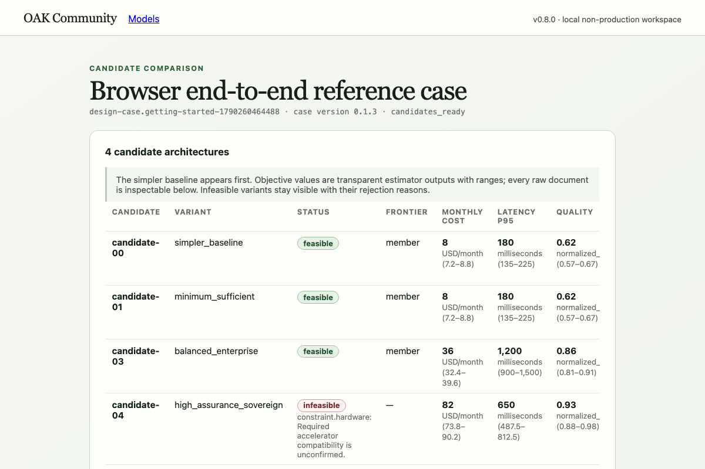

<!-- SPDX-License-Identifier: Apache-2.0 -->

# OAK Community

**Describe the AI system you want in plain English. OAK asks about whatever it can't work
out, lays the options out side by side (always including a simpler baseline), and turns
the one you choose into a plan you can check. It all runs on your own computer.**

Starting an AI project is easy. Getting it right is harder. Which model should it use?
What will it cost? What data may it touch? What happens when it's wrong, and who signs it
off? Those decisions usually end up scattered across chat threads and slide decks, and
nobody can check them later.

OAK makes those decisions explicit and repeatable. It works a bit like a **compiler**, the
program that turns source code into something a computer can run. OAK's "source code" is
your description of the system, called a **brief**. What comes out is a set of files: the
options it considered, the one you picked and why, a plan for testing it, and a precise
description of what to build. Like a good compiler, it doesn't guess silently. Every value
is labelled as something your brief said, something OAK inferred, or a standard default.
Anything important that's still unknown becomes a question for you. And the same input
always gives the same output.

<p align="center">
  
</p>

**Contents:**
[What OAK does](#what-oak-does-in-one-minute) ·
[Who it's for](#who-its-for) ·
[Why OAK](#why-oak) ·
[What gets installed](#what-gets-installed-and-what-doesnt) ·
[Install](#install-and-first-run) ·
[Everyday use](#everyday-use-after-the-first-run) ·
[Five ways in](#five-ways-in) ·
[MCP](#how-the-mcp-server-works) ·
[AI models](#optional-let-an-ai-model-read-your-brief) ·
[Limits](#what-oak-doesnt-do-yet) ·
[Contribute](#why-contribute-and-where-to-start) ·
[Docs](#documentation) ·
[Verifying a release](#verifying-a-release)

## What OAK does, in one minute

Here is the example that ships with OAK. A small engineering team wants a tool that
answers questions from a set of public technical manuals and cites the passage it used.

1. **You describe it.** Plain English is fine (see
   [`public-manual-qa-prose.md`](examples/briefs/public-manual-qa-prose.md)). So is a
   structured YAML or JSON file (see
   [`public-manual-qa.yaml`](examples/briefs/public-manual-qa.yaml)).
2. **OAK reads it and asks questions.** It pulls out what the brief actually says and
   records where each value came from. Then it asks up to five ranked questions at a time
   about anything that matters and is still unknown, such as "Confirm the highest data
   classification used by this design." Each question comes with a reason: "Data
   classification changes eligible components, handling, and deployment controls."
3. **You answer.** OAK won't move on until you do. It labels its own inferences and
   defaults, but it leaves the important unknowns to you.
4. **OAK lays out the options.** Each one gets estimates with ranges. Anything that breaks
   a hard requirement is ruled out, and it stays visible with the reason:

   | Option | In plain words | Cost / month | Reply time¹ | Quality² | Verdict |
   |---|---|---|---|---|---|
   | `candidate-00` simpler baseline | Keyword search that returns cited passages. No AI model | ≈ $8 | ≈ 0.18 s | 0.62 | feasible |
   | `candidate-01` minimum sufficient | The same search, and it also knows when to say "the manuals don't cover this" | ≈ $8 | ≈ 0.18 s | 0.62 | feasible |
   | `candidate-03` balanced | Search plus a small local AI model that drafts a cited answer | ≈ $36 | ≈ 1.2 s | 0.86 | feasible |
   | `candidate-04` high assurance | Search plus a bigger model that checks its own answers. It needs a hardware accelerator (such as a GPU) that nobody has confirmed | ≈ $82 | ≈ 0.65 s | 0.93 | **ruled out:** "Required accelerator compatibility is unconfirmed." |

   ¹ 19 out of 20 replies are at least this fast. ² An estimated quality score between 0
   and 1. All the figures come from the small, **synthetic** catalogue of components that
   ships for demonstration. They are estimates with ranges, not price quotes.
5. **You choose and say why.** For example: pick `candidate-03` because it is "a balanced
   trade-off between quality, cost, and operability". OAK records who decided, when, and
   why each alternative lost. That record can't be edited later, only followed by a
   newer version.
6. **OAK compiles the plan.** It writes an assurance plan (the tests, evidence and
   controls to put in place before anything goes live) and a deployment **bundle** (five
   files that say exactly what to build and where). **Nothing gets deployed.** The plan
   is inert. Running anything takes a separate signing, approval and verification step,
   which is deliberately hard to skip.

<details>
<summary><strong>New to the jargon?</strong> A few words you'll meet below</summary>

| Word | What it means here |
|---|---|
| **Brief** | Your description of the system you want. It can be plain English, or a structured YAML or JSON file |
| **Design case** | One brief plus everything OAK produces from it, with its full history. Each change makes a new version (`0.1.0`, `0.1.1`, …) |
| **Candidate** | One possible design (architecture) for the brief |
| **Bundle** | The compiled files describing the chosen design and the machine it's meant for |
| **Runner** | A separate program, the only thing allowed to carry out a plan, and only after checking every signature and approval itself |
| **CLI** | Command-line interface: the `oak` command you type in a terminal |
| **REST API** | The web-style interface that programs, including the browser workspace, use to talk to OAK over HTTP |
| **MCP** | Model Context Protocol: a standard way for AI assistants to use outside tools |
| **Deterministic** | The same input gives the same output every time, with no randomness |
| **Fingerprint (digest)** | A SHA-256 hash: a short code computed from a file's exact bytes. Change one byte and the fingerprint changes |
| **Audit trail** | The permanent, ordered record of every step: what happened, who did it, when, and through which interface |

</details>

## Who it's for

- **People who design AI features**, such as engineers, architects and tech leads. OAK
  gives you a structured way to go from "we want an AI thing" to options you can defend.
- **People who have to sign them off**, such as security, privacy, compliance and product
  owners. Every assumption, unknown, trade-off and decision is written down with its
  source.
- **Students and tinkerers** who want to see how careful AI-system design is done. OAK
  makes each step visible, and you can read every file it produces.
- **Tool builders** who want a design step inside an AI assistant, an automated build
  pipeline (CI) or a developer portal. For exactly that, OAK has an MCP server, a REST
  API, and a signed format for event notifications (webhooks).

**What it isn't:** OAK doesn't run your AI application or sit between your users and your
models. It's a planning and review tool. This release is a local developer release, and it
isn't built for live customer systems (see [What OAK doesn't do yet](#what-oak-doesnt-do-yet)).

## Why OAK?

- **It never guesses silently.** Facts from your brief, OAK's own inferences and
  standard defaults are each labelled as what they are. An unknown is never quietly
  treated as "fine", and an unconfirmed hard requirement rules an option out rather than
  letting it through.
- **Same input, same output, everywhere.** OAK is deterministic: identical inputs give
  byte-identical results. We ran the example twice, once with the command line on a
  laptop and once through the server in Docker, and the fingerprint of the compiled
  design was identical both times (`sha256:2ef34758…`).
- **A simpler option is always on the table.** OAK always generates a simpler baseline to
  compare the others against. In the example that baseline uses no AI model at all, and
  sometimes that's the right answer.
- **Every decision leaves a trail.** Nothing is overwritten. Each change creates a new
  version, and an audit timeline records who did what, when, and through which
  interface.
- **AI is optional and on a leash.** OAK works with no AI model and no account. If you
  choose to, a model can help read a plain-English brief, either an open model on Hugging
  Face using your own token or one running on your own machine. What it proposes is
  labelled as the model's, can't override what you wrote, and must be confirmed by you.
- **Plans aren't permissions.** Compiling never executes anything. Actually running a plan
  needs separate signing and approval keys, plus a separate program (the **runner**) that
  re-checks everything itself. No AI assistant can approve or run anything through OAK's
  MCP server.
- **Local and private by default.** It runs on your computer, listens only on your own
  machine (`127.0.0.1`), needs no account, and never phones home.
- **Open and honest.** It's Apache-2.0 licensed and built from open components. It keeps a
  public register of [what it does *not* defend against](docs/security/residual-risk.md).

## What gets installed (and what doesn't)

There are two ways to run OAK. You can use either or both.

| | **Docker way** (browser workspace) | **Source way** (command line) |
|---|---|---|
| **You install first** | [Docker](https://docs.docker.com/get-started/get-docker/) with Compose (Docker Desktop on a Mac), plus `git` | `git` and [`uv`](https://docs.astral.sh/uv/getting-started/installation/), a Python package manager |
| **OAK then sets up** | Container images, built or downloaded on your machine (roughly 1–2 GB of disk, counting what the build needs), plus five containers and three storage volumes, all inside Docker | A private Python environment (`.venv`) inside the folder you cloned. `uv` downloads the exact Python version it needs by itself |
| **What you get** | The web app at `http://127.0.0.1:5173`, the REST API at `http://127.0.0.1:8080`, and the MCP server for AI assistants | The `oak` command. It keeps each design case in an ordinary folder, with no database, no server and no Docker |

To answer the common questions directly: **OAK does not install Docker or `uv` for you.**
It installs nothing system-wide and needs no admin rights. In the Docker way, `uv` and
Node.js are used *inside* the image build, so you don't need them on your machine. In the
source way, `uv` keeps the Python it downloads and its package cache in your home folder
(`~/.local/share/uv` and `~/.cache/uv`), where any other project that uses `uv` shares
them. Apart from the folders you point it at, OAK itself writes only to `~/.oak`, and
only once you use signing keys, AI-model settings or the runner. The one exception is
optional: if you install OAK's keychain support in the source way, a stored AI token goes
into your operating system's keychain instead.

This is what `docker compose up` starts:

| Container | What it does | Where you reach it |
|---|---|---|
| `web` | The browser app: a web page served by a small web server (nginx) | `http://127.0.0.1:5173` |
| `api` | The REST API that the browser and the remote CLI talk to. The MCP server runs inside this container too | `http://127.0.0.1:8080` |
| `worker` | Does the slower jobs in the background: generating options, evaluating, compiling | nothing to open |
| `postgres` | The database that stores your design cases | inside Docker only |
| `migrate` | Prepares or upgrades the database, then exits | nothing to open |

Your data lives in three Docker volumes. `oak-postgres-data` holds your cases,
`oak-artifacts` holds the files OAK produced, and `oak-model-state` holds your Hugging
Face token, if you store one. The four containers that keep running are capped at about
3.5 GB of memory between them. Those are ceilings, not what they normally use.

## Install and first run

Everything has been tested on **Macs with Apple silicon** (M-series). The command line
has also been tested on **Linux**. The Docker stack should work there too, but so far
it's only been run as Linux containers on a Mac. Intel Macs and Windows aren't supported,
although the Windows Subsystem for Linux (WSL2) counts as Linux.
[platforms.md](docs/platforms.md) says exactly what has been tested where.

### The Docker way: the browser workspace

Make sure Docker is running, then:

```bash
git clone https://github.com/nmasamba/OAK.git
cd OAK
docker compose up -d --build
```

The first build downloads and builds everything. It took about three minutes on the
machine we measured, and later starts take seconds. Check it's up:

```bash
curl http://127.0.0.1:8080/version
```

You should see `{"name":"OAK Community","version":"0.8.0",...}`. Now open
**<http://127.0.0.1:5173>**, paste a brief under "Describe what you want to build", and
follow the buttons. The [user manual](docs/manual/OAK-Community-Manual.pdf) walks through
every screen.

> **If the build fails with "operation timed out"**, your connection dropped while it was
> downloading packages. Run the same command again.

### The source way: the command line

You need `git` and `uv` (any 0.10 release). You don't need Docker, a database or a network
connection after this step.

```bash
git clone https://github.com/nmasamba/OAK.git
cd OAK
uv sync --frozen        # builds .venv with the exact, locked dependencies (a minute or two)
uv run oak --version    # prints 0.8.0
```

`uv run` runs a command inside OAK's own environment, and it works from any folder inside
the checkout. If you'd rather type plain `oak`, run `source .venv/bin/activate` once per
terminal. Now try your first case. It uses the plain-English example brief:

```bash
uv run oak init my-first-case
cd my-first-case
uv run oak design ../examples/briefs/public-manual-qa-prose.md
uv run oak questions
```

```text
Design case design-case.public-manual-qa-prose@0.1.1 is needs_confirmation with 5 questions
question.accountable-owner: Who is the accountable owner for the intended outcome? [open]
question.model-hardware: Which measured hardware and model constraints apply? [open]
...
```

OAK won't decide these for you: it needs your answers before it will generate options.
To see the **whole journey** end to end, use the structured example, which ships with an
answers file:

<details>
<summary>The complete journey, from brief to compiled bundle (ten <code>oak</code> commands)</summary>

Go back to the root of the checkout first (`cd ..`), then:

```bash
uv run oak init demo && cd demo
uv run oak design ../examples/briefs/public-manual-qa.yaml
uv run oak questions
uv run oak confirm --answers ../examples/briefs/public-manual-qa-answers.yaml
uv run oak candidates
uv run oak evaluate candidate-03
printf 'Balanced trade-off between quality, cost, and operability.\n' > decision.md
uv run oak select candidate-03 --rationale-file decision.md
uv run oak assure candidate-03 --output ./assurance
uv run oak plan candidate-03 --target ../examples/targets/local-fixture.yaml --output ./bundle
uv run oak export --output ../case-export
```

```text
Design case design-case.public-manual-qa@0.1.1 is needs_confirmation with 5 questions
...
Recorded design-case.public-manual-qa@0.1.2 as ready_for_candidates
ID            VARIANT                    STATUS      FRONTIER  REJECTIONS
candidate-00  simpler_baseline           feasible    true      0
candidate-01  minimum_sufficient         feasible    true      0
candidate-03  balanced_enterprise        feasible    true      0
candidate-04  high_assurance_sovereign   infeasible  false     1
Evaluation evaluation-result.candidate-03 is pass
Selected candidate-03 in decision.candidate-03
Wrote assurance.candidate-03 to assurance
Compiled bundle.candidate-03.target.local-fixture to bundle; no target action was invoked
Exported design-case.public-manual-qa@0.1.7 to ../case-export
```

`bundle/` now holds `architecture-decision.json`, `assurance-plan.json`,
`semantic-manifest.json`, `deployment-bundle.json` and a draft `runner-plan.json`.
[local-design-case.md](docs/local-design-case.md) and
[compiler-flow.md](docs/compiler-flow.md) explain each step.

</details>

<details>
<summary>Exact toolchain versions (for contributors and the curious)</summary>

These versions build OAK itself. They don't describe or limit the system OAK designs
for you.

- `uv` 0.10.x on your machine; CI and the API container use exactly 0.10.8
- Python 3.13.12, from `.python-version` (`uv` fetches it for you)
- Node.js 24.18.0 and `pnpm` 11.15.1, needed only to build the web app from source and
  to run the repository's checks. `pnpm` downloads that Node version by itself.

To work on OAK itself, run `make bootstrap` (it needs `pnpm` too) and then `make check`.
See [CONTRIBUTING.md](CONTRIBUTING.md).

</details>

## Everyday use, after the first run

**Docker way.** Run these from the `OAK` folder:

| To… | Run |
|---|---|
| Start OAK | `docker compose up -d --build` |
| Check which version is running | `curl http://127.0.0.1:8080/version` |
| Open it | <http://127.0.0.1:5173> |
| Stop it (your cases are kept) | `docker compose down` |
| Update to the latest code | Back up first if your cases matter ([operations.md](docs/operations.md#back-up)). Then `git pull` and `docker compose up -d --build` |
| See what's running | `docker compose ps` |
| See a service's output | `docker compose logs -f api`. That's startup messages and errors only, because OAK keeps no application log yet (`RR-015`) |
| Delete everything and start over | `docker compose down --volumes`. **This deletes all your cases** |

Always include `--build`. If nothing has changed it only costs a few seconds. If you've
pulled new code, it's the only way to actually run it. Without it, Docker quietly reuses
the old image, which is why checking `/version` is a good habit.

**Command line.** Each case is a folder. `cd` into it and carry on where you left off, for
example with `uv run oak questions`. Two more things are worth making habits:

- **To back a case up or move it**, run `uv run oak export --output ../backup` inside the
  case folder. To bring it back, run `uv run oak import ../backup --directory ../restored`.
- **To update**, run `git pull && uv sync --frozen`. Export your cases first.

## Five ways in

The browser isn't the only way in. Every interface calls the same code underneath, so a
step gives the same result, and the same refusals, whichever way you come in, and none of
them gets a back door. Some are deliberately narrower than others. An AI assistant, for
example, can't choose the design, and only the local CLI can sign or approve anything.

| Way in | Good for | How to reach it |
|---|---|---|
| **Browser** | Reviewing and deciding, visually | <http://127.0.0.1:5173> |
| **Local CLI** | Working offline on your own machine, and scripting | `uv run oak …` |
| **REST API** | Connecting other tools, from anything that speaks HTTP | `curl http://127.0.0.1:8080/v1/…` |
| **Remote CLI** | The same `oak` commands, working on the shared server's cases | `uv run oak --server http://127.0.0.1:8080 …` |
| **MCP** | Letting an AI assistant do the legwork | `docker compose exec -T api oak-mcp` |

[**The guided tour**](docs/tour.md) passes **one** case through four of them. The case is
created in the browser, its questions are read with `curl` and answered from the remote
CLI, options are generated by an AI assistant over MCP, a person chooses the design, and
the assistant compiles the plan. Then the tour checks the result against an offline run
through the fifth, the local CLI. This is the audit trail the relay produced:

| # | What happened | Recorded as | Done by |
|---|---|---|---|
| 1 | `case_created` | `api` | you, in the browser |
| 2 | `brief_interpreted` | `api` | you, in the browser |
| 3 | `claims_confirmed` | `api` | you, with the remote CLI |
| 4 | `candidates_generated` | `mcp` | the AI assistant |
| 5 | `candidate_evaluated` | `mcp` | the AI assistant |
| 6 | `candidate_selected` | `api` | **you**, in the browser (the assistant isn't allowed to choose) |
| 7 | `assurance_planned` | `mcp` | the AI assistant |
| 8 | `bundle_compiled` | `mcp` | the AI assistant |

The browser and the remote CLI both work through the REST API, so their steps are
recorded as `api`. And the compiled design's fingerprint matched the offline run exactly.

### How the MCP server works

[MCP (Model Context Protocol)](https://modelcontextprotocol.io) is a standard way for an
AI assistant to use outside tools. The assistant starts a small helper program and sends
it requests as lines of JSON, and the program answers the same way. OAK's helper is
`oak-mcp`. When you use Docker, it runs inside the `api` container, so it sees exactly the
same cases as the browser.

**Try it yourself.** This starts the server, says hello, and asks for its list of tools:

```bash
printf '%s\n' \
  '{"jsonrpc":"2.0","id":1,"method":"initialize","params":{"protocolVersion":"2025-06-18"}}' \
  '{"jsonrpc":"2.0","id":2,"method":"tools/list"}' \
  | docker compose exec -T api oak-mcp
```

```text
{"id": 1, "jsonrpc": "2.0", "result": {"capabilities": {"tools": {}}, "protocolVersion": "2025-06-18", "serverInfo": {"name": "oak-mcp", "version": "0.8.0"}}}
{"id": 2, "jsonrpc": "2.0", "result": {"tools": [{"name": "oak_design_case_create", ...
```

**Connect your assistant.** Most AI assistants and code editors that support MCP accept a
JSON entry like this one. Use the full path to your checkout:

```json
{
  "mcpServers": {
    "oak": {
      "command": "docker",
      "args": ["compose", "-f", "/full/path/to/OAK/compose.yaml", "exec", "-T", "api", "oak-mcp"]
    }
  }
}
```

If the assistant says it can't find `docker`, put in the full path that `which docker`
prints.

**What the assistant can do:** create a case, read it, interpret the brief, list the
questions, record answers (under a named person), generate, list and evaluate options,
create the assurance plan, compile the bundle, and check on slow jobs. That's 11 tools in
all. **What it can't do:** choose the design, which is left to a person on purpose. It
also can't sign, approve, run anything, read files, run commands or change your AI-model
settings; those are ruled out permanently for MCP. If it asks for a tool that doesn't
exist, the answer is simply "tool is not available". The tour walks through
[every request, with the real replies](docs/tour.md#step-4--an-ai-assistant-generates-and-evaluates-the-options),
and [interfaces.md](docs/interfaces.md) has the complete permission model.

## Optional: let an AI model read your brief

Out of the box, OAK reads briefs **deterministically**. It maps what the brief states
outright, asks about the rest, and nothing leaves your machine. You can ask a model to
propose the rest instead, which helps most with a plain-English brief. You choose
separately for each brief:

| Mode | What happens | What leaves your machine |
|---|---|---|
| **Deterministic** (default) | No model. Maps what the brief states and asks about everything else | Nothing |
| **Online AI** | One open model reads the brief through [Hugging Face](https://huggingface.co)'s Inference Providers, a service that runs open models for you, using **your own** Hugging Face token | That brief, sent to Hugging Face and the provider it routes to, under their terms ([`RR-039`](docs/security/residual-risk.md)) |
| **Local AI** | A model server on the same machine as the `oak` command reads it, for example Ollama or any other OpenAI-compatible server. This needs the source way: inside Docker, "this machine" is the container, which can't reach a server on your computer | Nothing |

```bash
uv run oak models set-key                                   # paste your Hugging Face token (it is hidden, checked, and stored)
uv run oak models discover                                  # see which model would be used
uv run oak design my-brief.md --interpreter online          # this brief only
```

In the browser, the choice is the "How should this brief be read?" dropdown, and
**Settings → Models** is where you set up Online AI. Some things worth knowing:

- **Your token stays on your machine.** It's kept in a file only your user account can
  read (under Docker, in the `oak-model-state` volume). With the source way you can opt
  into your operating system's keychain instead. No interface ever shows the token again.
  MCP and the remote CLI can't read, store or change it, although they can ask for an
  Online AI reading that uses it. Checking the token is one free request to Hugging Face
  that generates nothing. The result is shown with its age, and `oak models verify`
  re-checks it.
- **Which model?** The one you pin, or else the "preferred" one. That's the top trending
  open model on Hugging Face that anyone can use without asking for access, comes from a
  trusted publisher, and has a provider that can return answers in OAK's structured
  format, publishes a price, and is fast enough to answer within the time limit.
- **Cost.** Your free monthly Hugging Face credit is used first. OAK promises nothing
  beyond it and never buys credit.
- **The model only suggests.** Its values are marked "Proposed by model". It can fill
  only OAK's own fixed set of fields and never overwrites what your brief says. Every
  section it touched becomes a question you must answer before OAK will generate options.

[operations.md](docs/operations.md#configure-a-model-provider) covers setting this up
under Docker. The decision record
[ADR-0016](docs/adr/architecture/0016-user-supplied-model-provider-credentials.md)
(an "architecture decision record") explains how the token is handled and why.

## What OAK doesn't do (yet)

OAK Community `0.8.0` is a **local-first developer release**. Be clear about what that
means:

- **It isn't built for live or customer systems.** It makes no production-readiness claim,
  and no external security review was commissioned. Every security statement in this
  repository describes work the project did itself.
- **It's single-user and local.** There are no logins and no multi-user separation, and
  it listens only on your own machine.
- **It won't deploy anything real.** Signing keys are development keys. The runner will
  only touch a built-in demonstration target, and the only change it can ever make is
  creating and then removing one network-isolated container that never starts.
- **Some parts record rather than enforce.** Policy checks are recorded but don't block
  anything yet. The bundled component catalogue and the bundled set of policy rules (the
  "policy pack") are synthetic examples: not real prices, and not legal advice.
- **Some interfaces are deliberately narrow.** The MCP server serves one assistant per
  process. The remote CLI trusts whichever server you point it at, and refuses the
  local-only signing and runner commands. OAK defines the signed webhook format and ships
  a checker for it, but nothing that actually sends the notifications.
- **Your Hugging Face token is stored like a setting, not locked away.** Other programs
  running as you can read it ([`RR-040`](docs/security/residual-risk.md)), nothing caps
  what model calls spend ([`RR-041`](docs/security/residual-risk.md)), and a stored check
  of the token describes the moment it was made, not now
  ([`RR-042`](docs/security/residual-risk.md)).

The complete, numbered list of what isn't defended is
[security/residual-risk.md](docs/security/residual-risk.md), and progress is tracked in
[STATUS.md](STATUS.md).

## Why contribute, and where to start

OAK is a young, open project that takes care over its claims: something only counts as
working when a test or a recorded run shows it. That makes it a good place to learn real
engineering, such as compilers and determinism, security boundaries, reproducible builds
and AI governance. The pieces are small enough that one person can own a useful change,
and the known gaps are written down in public with ids, so you can pick one up and know
what "done" means.

Some ways in, from a first afternoon to a bigger project:

- **Try it and tell us what confused you.** Run [the tour](docs/tour.md) on a fresh
  machine. Confusing docs and unhelpful error messages are real bugs here.
- **Write a new example brief** for a different kind of AI system (support triage, a
  study helper, document search in another field) and see how far OAK gets with it.
  Where it falls short is exactly what the project needs to know.
- **Pin down a behaviour with a test.** [threat-coverage.md](docs/security/threat-coverage.md#named-gaps)
  lists scoped gaps nobody has tested yet.
- **Improve the web app.** It has no unit tests yet (`RR-021`), and the trade-offs would be
  easier to read as a chart than as a table.
- **Add a deployment backend or a pack.** A "renderer" turns OAK's plan into files for one
  particular deployment tool. Two ship today, plain local manifests and a Helm chart for
  Kubernetes. OpenTofu or Terraform, Crossplane, Ansible, and model-serving profiles such
  as vLLM or llama.cpp are on the backlog. So are packs, which are bundles of policy
  rules, domain knowledge or evaluation tests. See [extension-sdk.md](docs/extension-sdk.md).
- **Widen where it runs.** Nobody has yet recorded a run of the Docker stack on an Intel
  or AMD Linux machine. The automatic checks (CI) don't run on macOS or Arm machines yet
  (`RR-014`). Native Windows support would start with replacing a Unix-only file lock (see
  [platforms.md](docs/platforms.md)).
- **Harden the operations side.** Useful work includes logging and metrics that leak
  nothing (`RR-015`), a readiness check that notices an un-migrated database (`RR-016`),
  and reproducible container images (`RR-006`).

[CONTRIBUTING.md](CONTRIBUTING.md#where-you-could-help) has the full map, how to set up,
and how changes are reviewed.

## Documentation

[docs/README.md](docs/README.md) is the index. These are the ones most people need first:

| | |
|---|---|
| [manual/OAK-Community-Manual.pdf](docs/manual/OAK-Community-Manual.pdf) | An illustrated walkthrough from install to uninstall, with screenshots of every workspace screen. The source is in [manual/](docs/manual/) |
| [tour.md](docs/tour.md) | One case through every interface: browser, `curl`, remote CLI and an AI assistant over MCP |
| [Releases](https://github.com/nmasamba/OAK/releases) | Published downloads: the Python package (a wheel, plus the source as an sdist), a software bill of materials (an SBOM, listing everything inside) and `SHA256SUMS`. They're checksummed but not signed, so [verify them](#verifying-a-release) before installing |
| [platforms.md](docs/platforms.md) | Where OAK is supported, and where it isn't |
| [interfaces.md](docs/interfaces.md) | CLI, REST, MCP and portals: setup, permissions, and what each one can do |
| [operations.md](docs/operations.md) | Install, observe, back up, restore, upgrade, troubleshoot, uninstall |
| [configuration.md](docs/configuration.md) | Every `OAK_*` environment variable |
| [error-codes.md](docs/error-codes.md) | Every `OAK-*` error code, generated from the source |
| [performance.md](docs/performance.md) | Measured numbers, with the machine they came from |
| [security/residual-risk.md](docs/security/residual-risk.md) | What this release does not defend against |
| [release-process.md](docs/release-process.md) | What a release is, and how to verify one |
| [CONTRIBUTING.md](CONTRIBUTING.md) | Why and where to help, setting up, the test layout, the review policy |
| [SECURITY.md](SECURITY.md) | Reporting a vulnerability |

The official data formats (JSON schemas) and the synthetic examples live in
[`schemas/`](schemas/README.md) and [`examples/`](examples/README.md). [development.md](docs/development.md) covers every
`make` target, and [architecture.md](docs/architecture.md) covers the boundaries the code
enforces.

## Verifying a release

The newest **published** release is `0.7.1`, on the
[Releases page](https://github.com/nmasamba/OAK/releases). This repository is at `0.8.0`,
which is tagged and approved but not published anywhere yet. To run `0.8.0`, build it
from source as described above.

Each release comes with a `SHA256SUMS` file. It lists a fingerprint (a SHA-256 hash) for
the wheel, the sdist, the SBOM and the licence list. A fifth file, `build-provenance.json`,
describes the build and is deliberately left out of the list. Check your downloads
against it from the download folder:

```bash
sha256sum -c SHA256SUMS          # Linux
shasum -a 256 -c SHA256SUMS      # macOS
```

OAK also has a small verifier that behaves the same on both. It uses only Python's
standard library and needs no OAK installation. It exits `0` if everything verifies, `2`
on a mismatch, and `3` if the manifest or a file is missing or malformed:

```bash
python3 scripts/verify_release.py ./downloaded-release
```

What that proves: the files you have are the files the manifest lists. What it **doesn't**
prove: who made them. OAK Community release artifacts are **unsigned**, because no
maintainer signing key exists and this release doesn't invent one. Get `SHA256SUMS`
through a channel you trust independently of the downloads.
[release-process.md](docs/release-process.md#verifying-a-release) has the details.

## Licence

Licensed under the Apache License, Version 2.0. See [`LICENSE`](LICENSE).
